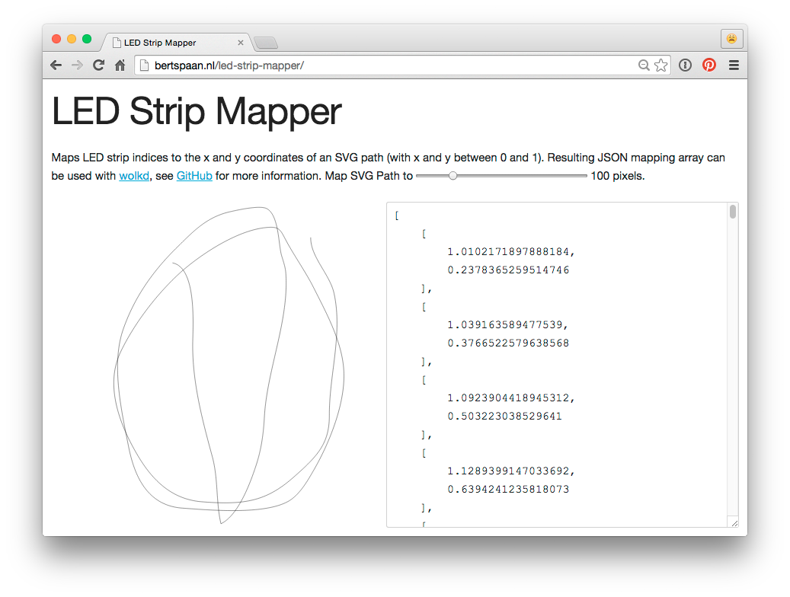

# LED Strip Mapper

[bertspaan.nl/led-strip-mapper](http://bertspaan.nl/led-strip-mapper)

Maps LED strip indices to the x and y coordinates of an SVG path (with x and y between 0 and 1). LED Strip Mapper expects an SVG file containing a single SVG path, and maps the pixels of a LED strip by placing LED pixels at regular intervals on the SVG path using [`SVGPathElement`](https://developer.mozilla.org/en/docs/Web/API/SVGPathElement)'s `getPointAtLength` function. By default, LED Strip Mapper loads `mapping.svg`, you can edit `index.html` to change this.

__With LED Strip Mapper, it's possible to write/play animations on RGB LED strips by using x and y coordinates, instead of just the LED index on the strip.__

Resulting JSON mapping array can be used with <a href="https://github.com/bertspaan/wolkd">wolkd</a>, a Node.js server and user interface to control RGB LED strips.

## Usage

Clone this repository, create your own SVG file, edit or replace `mapping.svg`, run `python -m SimpleHTTPServer` and point your browser to [http://localhost:8000](http://localhost:8000).

